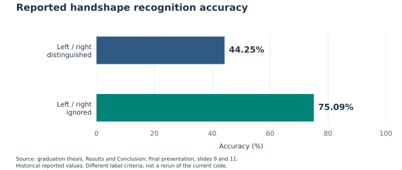
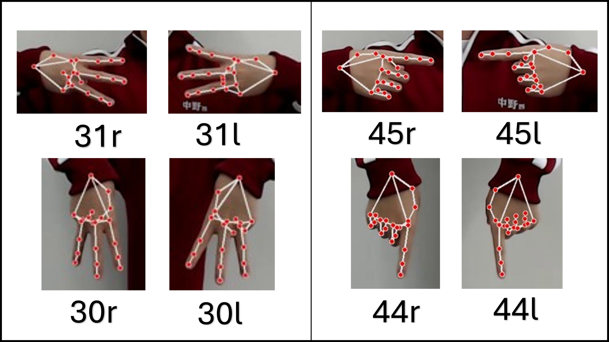
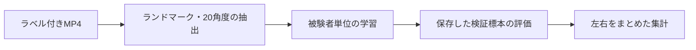

# syukei_recognize

## 骨格推定と機械学習を用いた日本手話の手形認識

**Japanese Sign Language Handshape Recognition with Landmark Estimation and Machine Learning**

北川 温人 · 三浦研究室 · 高専卒業研究

[研究の詳細](docs/research.md) · [ラベル一覧](docs/labels.md) · [実行手順](docs/usage.md) · [データ形式](docs/data-format.md) · [出典](docs/sources.md)

日本手話の手形59種類を対象に、撮影動画から手のランドマークを推定し、関節角度を用いたニューラルネットワークで分類する研究です。被験者10名からデータを収集し、被験者単位の5分割交差検証で、左右の区別と手の向きが認識に与える影響を調べました。

本リポジトリには、研究コード、卒業論文・発表資料に基づく説明、報告結果の表とグラフを収録しています。旧名は `matura_arbeit` です。撮影動画、学習用の全標本、学習済みモデルは同梱していません。

## 主要な結果

| 評価条件 | 研究時の報告正解率 |
| --- | ---: |
| 右手と左手を区別する | **44.25%** |
| 右手と左手を区別しない | **75.09%** |



**図1. 卒業論文と最終発表で報告された正解率。** 出典：卒業論文「評価実施」「まとめ」、最終発表スライド9・11。[出典の対応](docs/sources.md#表とグラフ) · [数値のCSV](docs/tables/reported-overall-accuracy.csv) · [PNG版](docs/figures/reported-overall-accuracy.png)

左右の条件を変えると、正解とみなすラベルも変わります。この比較はモデル改良による精度向上を示すものではありません。また、数値は資料からの転記であり、現在のコードを再実行した測定値ではありません。集計方法や入力特徴量には[資料と実装の相違](docs/sources.md#implementation-differences)があります。

## 研究の位置付け

手形は手話に現れる手の形と向きに関わる要素です。本研究では、手の形から手話単語を検索する竹村茂『手話・日本語大辞典』の分類を参照しました。指文字に加えて、握り拳の向きや、指文字だけでは表せない手指形状を含む59種類を扱います。出典：卒業論文「手形」「目的」、[参考文献](docs/sources.md#参考文献)。

研究の目的は、手形のデータセットを作り、骨格推定と機械学習による分類を評価することです。将来的には手話単語・文中での手形認識や、手形からの単語検索への応用を想定しています。現在のコードが扱う範囲は、静止した手形のフレーム単位の分類です。

## データと実験条件

| 項目 | 内容 |
| --- | --- |
| 被験者 | 10名（t1〜t10） |
| 研究対象 | 59種類の手形 |
| 撮影対象 | 59手形＋指文字「け・ち・つ・へ」＝63種類 |
| 収録条件 | 白い背景、赤いジャージ、カメラとの距離1.5 m、高さ1.3 m、各ポーズ2秒以上静止 |
| 報告データ規模 | 約6,000標本。59種類×左右2×10名×5フレームの想定規模は5,900 |
| 特徴抽出 | 各手21点のランドマーク、20個の関節角度、左右・方向情報を保存 |
| 分類器 | 全結合層128 → 256 → 256 → 128、Batch Normalization、ReLU、Dropout、Softmax |
| 学習条件 | Adam、バッチサイズ16、最大100エポック、Early Stopping の patience 30 |
| 評価 | 被験者単位の5分割交差検証 |

出典：卒業論文「データセット作成」「認識モデル作成」「評価設計」、スライド5〜8。最終採用標本数や被験者ごとの内訳は未確認です。[実験条件・数式・評価方法の詳細](docs/research.md) · [全63ラベルと採用区分](docs/labels.md)

現行コードのモデル入力は **20個の角度のみ**です。`yaw` と `rl` は保存しますが入力に含めません。出力クラス数は左右を含む実際のラベル数から決まり、59手形の左右が揃えば118クラスになります。

## 誤認識から分かった課題

論文では、同じ手形の左右の取り違えに加え、手の向きだけが異なる類似手形や、カメラ方向を向いて指が隠れる手形で誤認識が見られました。



**図2. 手の向きが異なる類似手形。** 卒業論文 図10を原画像のまま掲載。左側は30（マ型）と31（ミ型）、右側は45（一型）と44（人差指下）の比較で、`r` / `l` は右手 / 左手です。

左右をまとめた報告結果でも、01（ア型）は99.00%である一方、52（握り拳平）は20.00%、61（Q型）は25.00%でした。角度だけでは捉えにくい向きの違いや、骨格推定誤差への対処が課題です。[ラベル別の結果表・グラフと考察](docs/research.md#報告された認識結果)

## コードの構成



| ファイル | 役割 |
| --- | --- |
| [extract_hand_features.py](extract_hand_features.py) | 動画から手の座標・角度・画像を抽出 |
| [training_utils.py](training_utils.py) | 標本選択、JSON入出力、分類モデルの定義 |
| [train_cross_validation.py](train_cross_validation.py) | GroupKFold による学習と標本・分割情報の保存 |
| [evaluate_models.py](evaluate_models.py) | fold ごとの Top-10 確率とクラス別正解率 |
| [summarize_results.py](summarize_results.py) | 左右を同一視した Top-1 正解率の集計 |
| [scripts/generate_research_figures.py](scripts/generate_research_figures.py) | 転記した論文報告値からグラフを再描画 |

学習・評価では同じ `selected_data.json` を使い、標本の選び直しによる行番号のずれを防ぎます。既存コードからの変更は[移行メモ](docs/migration.md)にまとめています。

## 実行

Python 3.10〜3.12 と [requirements.txt](requirements.txt) の依存ライブラリを使用します。仮想環境の準備、入力ファイルの命名、保存場所の指定は[実行手順](docs/usage.md)を参照してください。

`data/video/` に `t1_01.mp4` のような動画を用意した後、次の順に実行します。

```sh
python extract_hand_features.py
python train_cross_validation.py
python evaluate_models.py
python summarize_results.py
```

新しい実験では空のモデル・評価出力先を使用してください。標準の5分割には、有効な標本を持つ被験者が5名以上必要です。

```sh
python -m unittest discover -s tests -v
```

テストは人工データによる処理の接続と整合性を確認するものです。研究時の精度を再現するテストではありません。各 fold の検証データをモデル選択にも使うため、独立した最終テストによる性能ではない点にも注意してください。

## 研究資料と引用

- [研究の方法と結果](docs/research.md)：特徴量の式、モデル、交差検証、結果表、誤認識の分析
- [ラベル一覧](docs/labels.md)：卒業論文 表1の全63ラベルと59手形への採用区分
- [出典と資料の対応](docs/sources.md)：原資料、図表の出典、資料と実装の相違、参考文献
- [引用情報](CITATION.cff)：著者とリポジトリのメタデータ

報告結果を参照する場合は対応する論文の節・表を、コードを利用する場合はリポジトリと利用したコミットを記載してください。
