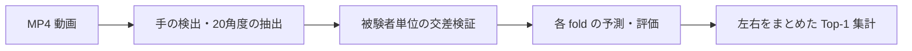

# syukei_recognize

**手形認識 / Handshape Recognition** — 高専時代に取り組んだ、手の形を分類する研究コードです。

動画から MediaPipe Holistic で左右の手を検出し、手のランドマークから求めた **20個の角度**を全結合ニューラルネットワークに入力します。被験者単位の交差検証と、左右の違いをまとめた結果の集計までを扱います。

旧リポジトリ名は `matura_arbeit` です。撮影動画、実験データ、学習済みモデル、手形番号の対応表は含まれていません。手元のデータを用意して実行してください。

## 処理の流れ



| ファイル | 役割 | 主な出力 |
| --- | --- | --- |
| [extract_hand_features.py](extract_hand_features.py) | 動画から座標・角度・画像を抽出 | `hand_info/`、`pos/`、`frame/`、`landmark/` |
| [training_utils.py](training_utils.py) | 標本の選択、JSON 入出力、モデルの定義 | 各スクリプトで共有 |
| [train_cross_validation.py](train_cross_validation.py) | 被験者単位の GroupKFold 学習 | `.keras` モデル、標本、分割情報 |
| [evaluate_models.py](evaluate_models.py) | 保存された検証標本の評価 | Top-10 確率、クラス別正解率 |
| [summarize_results.py](summarize_results.py) | 左右を同一視した Top-1 集計 | `rl_result.json` |

## セットアップ

Python **3.10〜3.12** を想定しています。依存ライブラリは [requirements.txt](requirements.txt) に記載しています。MediaPipe は、この実装で使用する `mp.solutions.holistic` を利用できる [0.10.21](https://pypi.org/project/mediapipe/0.10.21/) に固定しています。

```sh
git clone https://github.com/31916/syukei_recognize.git
cd syukei_recognize
python -m venv .venv
```

仮想環境を有効にします。

```powershell
# Windows PowerShell
.\.venv\Scripts\Activate.ps1
```

```sh
# macOS / Linux
source .venv/bin/activate
```

```sh
python -m pip install -r requirements.txt
```

## 実行方法

### 1. 動画を配置する

`data/video/` に、`<被験者ID>_<手形番号>.mp4` という名前で動画を置きます。

```text
data/video/
├── subject01_01.mp4
├── subject01_02.mp4
├── subject02_01.mp4
└── ...
```

被験者 ID と手形番号には `_` を含めないでください。手形番号には元データと同じゼロ埋め表記を使います。左右の接尾辞 `r` / `l` は抽出時に自動で付加されます。

### 2. 特徴量を抽出する

```sh
python extract_hand_features.py
```

例えば `subject01_01.mp4` から、`data/output/hand_info/subject01_01r.json` と `subject01_01l.json` を作ります。検出された手がない場合は空配列になります。JSON の詳細は [データ形式](docs/data-format.md) を参照してください。

### 3. 交差検証で学習する

```sh
python train_cross_validation.py
```

デフォルトでは 5 分割、最大 100 エポック、バッチサイズ 16 です。有効な標本を持つ被験者が **5人以上**必要です。同一被験者が学習側と検証側にまたがらないように分割します。

```sh
python train_cross_validation.py --folds 3 --epochs 50 --batch-size 16
```

各 JSON の左右それぞれから最大 5 フレームを抽出します。選んだ標本を `selected_data.json` に保存し、評価にも同じ標本・同じ順序を使用します。

### 4. 評価・集計する

```sh
python evaluate_models.py
python summarize_results.py
```

評価は `model/` 内に保存された標本・クラス順・検証インデックスを読み込みます。抽出元の JSON は読み直しません。

```text
data/output/
├── frame/                    # 元のフレーム画像
├── landmark/                 # 手の骨格を重ねた画像
├── pos/                      # 左右21点の画素座標
├── hand_info/                # 20角度、方向、左右情報
├── model/
│   ├── selected_data.json    # 学習・評価で共有する標本
│   ├── label_encoder.json    # モデル出力に対応するクラス順
│   ├── fold_info.json        # モデル名と検証標本の行番号
│   ├── run_config.json       # 学習条件
│   ├── best_models_info.json
│   └── best_model_fold_*.keras
└── evaluation/
    ├── fold_1/
    │   ├── top_10_predictions.json
    │   └── results.json
    ├── ...
    └── rl_result.json        # 左右をまとめた Top-1 正解率
```

### 保存場所を変更する

各スクリプトの `--help` で引数を確認できます。デフォルトの `data/` は**リポジトリの場所を基準**とし、明示した相対パスはコマンド実行場所を基準とします。

```sh
python extract_hand_features.py --video-dir ../videos --output-dir ../experiment
python train_cross_validation.py --data-dir ../experiment/hand_info --output-dir ../experiment/model
python evaluate_models.py --model-dir ../experiment/model --output-dir ../experiment/evaluation
python summarize_results.py --evaluation-dir ../experiment/evaluation
```

学習・評価には空の出力ディレクトリを指定します。再実験は別ディレクトリに保存してください。特徴量抽出は同名の JSON・画像を上書きしますが、以前に保存した余分な画像は削除しないため、条件を変えるときは新しい出力先を使ってください。`data/` やモデルファイルは Git の追跡対象から除外しています。

## 研究時の設定と評価の読み方

- **入力**：2次元の画素座標から求めた20角度。`yaw` と左右フラグ `rl` は JSON に保存しますが、モデルの入力には使いません。
- **クラス**：`01r` と `01l` のように、学習・fold ごとの評価では左右を区別します。
- **除外番号**：`09`、`17`、`18`、`28`、`64` を元実装に合わせて除外します。除外理由と番号の意味は、このリポジトリだけからは分かりません。
- **モデル**：Dense 128 → 256 → 256 → 128 → Softmax。中間層に Batch Normalization、ReLU、Dropout を使います。
- **学習**：Adam、categorical cross-entropy、検証損失による Early Stopping（patience 30）を使用します。
- **評価値**：クラス別正解率の単純平均（macro average）と母分散です。標本数で重み付けした全体正解率とは異なります。
- **左右をまとめる集計**：最上位候補の `r` / `l` を外して正誤を判定します。左右の確率を足し合わせて候補を並べ直す処理ではありません。

元の実験方式を引き継ぎ、各 fold の検証データを最良モデルの選択と評価の両方に使っています。**独立した最終テストデータによる性能ではありません。** また、移動量の閾値（既定 15 px）は画像・座標の保存に適用され、角度データの保存には適用されません。

このコードはフレームごとの手形分類を扱います。連続した手話の文章認識、リアルタイム推論 UI、Top-5 / Top-10 正解率の集計は実装していません。実データや確定した精度を示す結果は同梱していないため、数値による性能の主張はしていません。

## 動作確認

```sh
python -m unittest discover -s tests -v
```

人工データで、標本の再利用、被験者分割、学習から評価・集計までの接続、手が写っていない動画の抽出処理を確認します。元の研究データでの精度再現は別途必要です。

旧ファイル名からの対応と変更点は [移行メモ](docs/migration.md) を参照してください。
