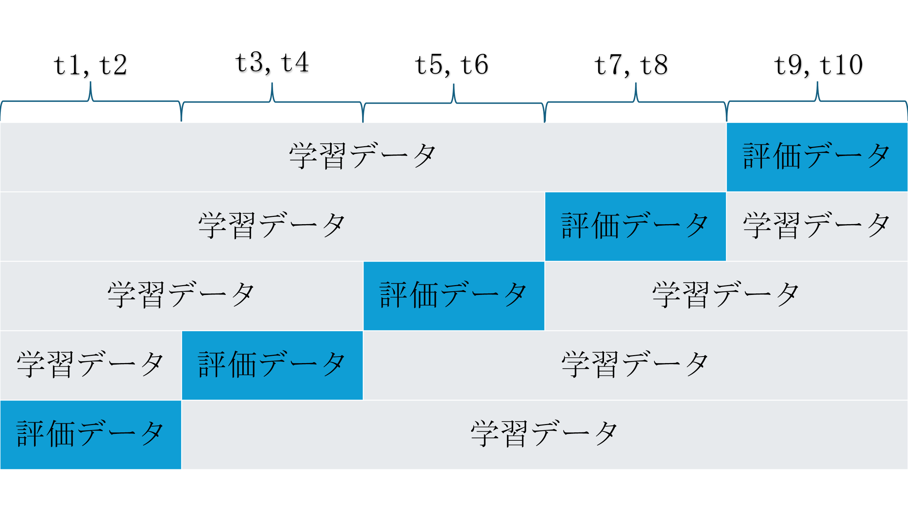
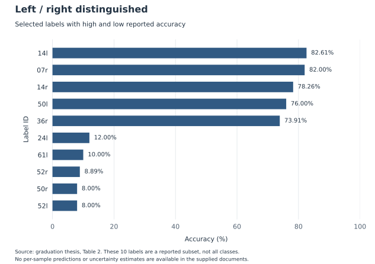
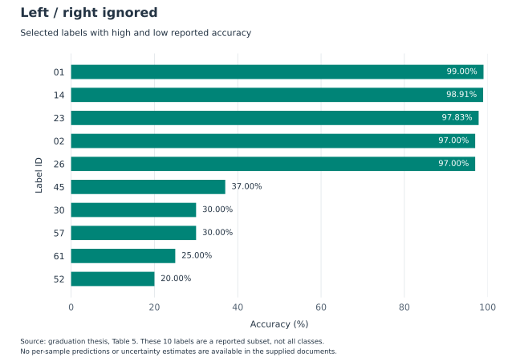
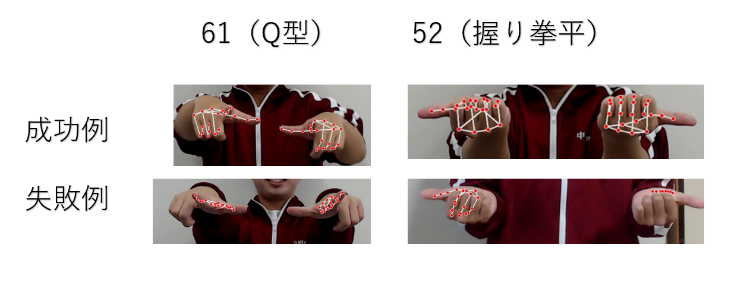

# 研究の方法と結果

**骨格推定と機械学習を用いた日本手話の手形認識**

北川 温人／三浦研究室／高専卒業研究

[README](../README.md) · [ラベル一覧](labels.md) · [実行手順](usage.md) · [出典と資料の相違](sources.md)

## 背景と目的

この研究は、日本手話の構成要素である手形を、骨格推定と機械学習で分類することを目的とします。手形の定義には、手の形から単語を検索する仕組みを持つ竹村茂『手話・日本語大辞典』を参照し、同書を基に選んだ59種類を対象としました。指文字だけでは扱いきれない握り拳の向きや、手話動作に現れる手指形状も含みます。出典：卒業論文「はじめに」「手形」「目的」、[参考文献1](sources.md#参考文献)。

研究の作業は、撮影条件を揃えたデータセットの作成、関節角度を使う分類器の構築、未知の被験者に対する評価です。将来的には、手話の単語・文中から手形を取り出すことや、手形から手話単語を検索する辞典への応用を想定しています。このリポジトリの実装範囲はフレーム単位の分類です。

## データセット

| 項目 | 卒業論文・発表資料の記載 |
| --- | --- |
| 被験者 | 10名（`t1`〜`t10`） |
| 研究対象 | 59種類の手形 |
| 撮影対象 | 59手形＋追加の指文字4種＝63種類 |
| 追加の指文字 | ケ型（09）、チ型（17）、ツ型（18）、ヘ型（28） |
| 左右 | 両手。抽出後のラベルに `r` / `l` を付加 |
| 静止時間 | 各ポーズを2秒以上保持 |
| 背景・衣服 | 白い背景、赤いジャージ |
| カメラと被験者の距離 | 1.5 m |
| カメラの高さ | 1.3 m |
| 解像度・フレームレート | 1980×1080 px、30 fps（論文の表記どおり。動画メタデータは未確認） |
| ラベル付け | 著者が手形を実演し、撮影後に手動で分割・ラベル付け |
| 報告データ規模 | 約6,000標本 |

出典：卒業論文「データセット作成」、表1、最終発表概要「データセット作成」、スライド5・6。[全63ラベルと採用区分](labels.md)に名称を掲載しています。

59種類×左右2×被験者10名×5フレームから計算した想定規模は **5,900標本**です。「約6,000」は原資料の概数であり、欠測や無効な角度を除いた最終採用数の実測値ではありません。現在のコードは各特徴量 JSON の左右それぞれから最大5標本を選択し、20個の有限な角度を持つ標本を採用します。元動画・全標本・被験者ごとの内訳は同梱していません。

## 特徴量

各手の21点のランドマークを画像平面上の座標に変換し、親指から小指まで各4個、合計20個の角度を求めます。現在の実装が使う3点の組は `extract_hand_features.py` の `ANGLE_LANDMARK_TRIPLETS` に記載しています。

3点 $P_1, P_2, P_3$ に対して、$P_2$ を頂点とする角度は次のとおりです。

$$
a=\lVert P_2-P_1\rVert_2,\quad
b=\lVert P_3-P_2\rVert_2,\quad
c=\lVert P_1-P_3\rVert_2
$$

$$
\theta=\arccos\!\left(\frac{a^2+b^2-c^2}{2ab}\right)\frac{180}{\pi}
$$

実装では `arccos` の入力を $[-1,1]$ に収め、長さ0の辺や無効な座標を持つ角度を除外します。`yaw` は手首（点0）から人差し指先端（点8）への画像平面上の方向です。

$$
\mathrm{yaw}=\operatorname{atan2}(y_8-y_0,\ x_8-x_0)
$$

現在のコードは `yaw` をラジアンで保存します。左右フラグ `rl` とともに JSON には保持しますが、**モデルに入力するのは20角度のみ**です。資料にある「角度・向き・左右を入力」という説明とは相違があります。[データ形式](data-format.md)と[相違点の一覧](sources.md#implementation-differences)を参照してください。

## 分類モデルと学習条件

| 段階 | 現行コードの構成 |
| --- | --- |
| 入力 | 20個の関節角度 |
| 全結合層1 | Dense 128、Batch Normalization、ReLU |
| 全結合層2 | Dense 256、Batch Normalization、ReLU、Dropout 0.5 |
| 全結合層3 | Dense 256、Batch Normalization、ReLU、Dropout 0.5 |
| 全結合層4 | Dense 128、Batch Normalization、ReLU、Dropout 0.3 |
| 出力 | Dense $C$、Softmax。$C$ は左右を含むクラス数 |

モデルの幅・層数・正則化は、卒業論文「認識モデル作成」の説明を引き継いでいます。59手形の左右がすべて揃えば $C=118$ ですが、実際にはデータからクラス数を決めます。資料のモデル図にある「59種類」は、そのまま現在の出力次元を意味しません。

| 学習条件 | 値・設定 |
| --- | --- |
| 最適化 | Adam。論文の学習率は0.001。コードは Adam の既定設定 |
| 損失 | Categorical cross-entropy |
| バッチサイズ | 16 |
| エポック上限 | 100 |
| 早期停止 | 検証損失が30エポック改善しない場合に停止（patience 30） |
| モデル保存 | 検証損失が最小の時点 |
| 論文に記された計算環境 | Intel Core i5-1135G7、RAM 16 GB、CPU、TensorFlow/Keras |

「30エポックで必ず終了する」という設定ではありません。乱数 seed、依存ライブラリ、入力標本の順序によって新しい実験の結果は変わり得ます。

## 被験者単位の交差検証

同じ被験者が学習側と検証側にまたがらない5分割交差検証を使います。10名を2名ずつの5群に分ける設計では、各回で8名を学習、2名を評価に使用します。

**図1. 卒業論文 図8の交差検証模式図。** 元画像をそのまま掲載しています。図に示す `t1,t2` などの具体的な組は説明用です。現行 `GroupKFold` の割当ては標本数などに依存し、保存された `fold_info.json` が実際の分割を示します。

現在のコードでは、選択した標本を `selected_data.json` に保存して評価に再利用します。同じ検証集合を最良モデルの選択にも使うため、報告・出力される値は独立した最終テスト集合の性能ではありません。

## 報告された認識結果

### 全体の正解率

| 評価条件 | 報告正解率 |
| --- | ---: |
| 左右を区別する | 44.25% |
| 左右を区別しない | 75.09% |

出典：卒業論文「評価実施」「まとめ」、最終発表概要「評価実施」、スライド9・11。[比較グラフ](figures/reported-overall-accuracy.svg) · [CSV](tables/reported-overall-accuracy.csv)

この差は**正解とみなすラベルの条件を変えた結果**です。モデルの改良による性能向上率を表してはいません。また、論文は fold ごとの正解率の平均を説明していますが、現在の評価コードはクラス別正解率の単純平均を計算します。元の予測データがないため、報告値の集計過程や現行コードによる再現は確認できていません。

### 左右を区別した場合

卒業論文 表2に掲載された上位・下位のラベルです。

| 高い正解率のラベル | 正解率 | 低い正解率のラベル | 正解率 |
| --- | ---: | --- | ---: |
| 14l セ型・左 | 82.61% | 50r 握り拳親・右 | 8.00% |
| 07r キ型・右 | 82.00% | 52l 握り拳平・左 | 8.00% |
| 14r セ型・右 | 78.26% | 52r 握り拳平・右 | 8.89% |
| 50l 握り拳親・左 | 76.00% | 61l Q型・左 | 10.00% |
| 36r ユ型・右 | 73.91% | 24l ネ型・左 | 12.00% |

**図2. 卒業論文 表2を再描画したグラフ。** 全クラスの分布ではなく、原表に掲載された10ラベルの抜粋です。[元の数値](tables/reported-label-accuracy.csv)

### 左右を区別しない場合

卒業論文 表5に掲載された上位・下位のラベルです。

| 高い正解率のラベル | 正解率 | 低い正解率のラベル | 正解率 |
| --- | ---: | --- | ---: |
| 01 ア型 | 99.00% | 52 握り拳平 | 20.00% |
| 14 セ型 | 98.91% | 61 Q型 | 25.00% |
| 23 ヌ型 | 97.83% | 30 マ型 | 30.00% |
| 02 イ型 | 97.00% | 57 屋根型 | 30.00% |
| 26 ヒ型 | 97.00% | 45 一型 | 37.00% |

**図3. 卒業論文 表5を再描画したグラフ。** ラベル名は[一覧表](labels.md)に対応します。標本単位の結果がないため、信頼区間や有意差は算出していません。

## 誤認識の分析

### 左右の取り違え

卒業論文 表3では、正解ラベル `01l` に対する上位候補が次の順序で示されています。左右を区別したときに誤りになっていても、手形そのものは候補の上位に現れる例です。

| 順位 | 予測ラベル | 原表の「信頼度」 |
| --- | --- | ---: |
| 1 | 01r ア型・右 | 4.87 |
| 2 | 01l ア型・左 | 4.57 |
| 3 | 52r 握り拳平・右 | 0.21 |
| 4 | 52l 握り拳平・左 | 0.17 |
| 5 | 15l ソ型・左 | 0.04 |

このスコアは原表の値を転記しています。1を超えているため確率とは扱わず、現行コードの Softmax 確率と比較しません。原表の `01l` の左右名称はラベル体系に合わせて左手と表記しています。[原資料の相違点](sources.md#implementation-differences)

### 骨格推定と手の向き

**図4. 卒業論文 図9の成功例・失敗例。** 論文では、カメラ方向を向く手や指が隠れる手形で、推定した関節位置の誤りが混入したと考察しています。21点が返されたことだけでは、各点が正しい場所にあることを保証できません。

また、マ型とミ型、一型と人差指下のように向きが異なる手形では、関節角度が似ていることが誤認識の要因として挙げられています。[論文 図10の実例](figures/orientation-confusions.png)を README に掲載しています。

画像平面内の回転・鏡映・一様拡大縮小では、理想的な角度は変化しません。このため、角度だけの表現から左右や画像平面内の向きを識別することには制約があります。これは特徴量の性質からの説明であり、掲載画像に対して要因を分離した実験結果ではありません。実際には投影、遮蔽、骨格推定誤差も影響します。

## 限界と今後の課題

- 被験者10名、撮影条件を揃えた静止手形が対象です。背景、衣服、距離、照明が異なる環境での頑健性や連続手話への適用は、この評価だけでは判断できません。
- 学習データ・モデル・標本単位の予測を同梱していないため、元の正解率、混同行列、統計的不確実性を再計算できません。
- 資料とコードには、入力特徴量、ブレの除外、評価値の集計方法に相違があります。再現実験では[相違の一覧](sources.md#implementation-differences)を解消し、条件を固定する必要があります。
- 論文では、向き・左右を表す特徴量の改善、輪郭・画像特徴や CNN の利用、LSTM による時系列情報の利用を今後の課題に挙げています。現在のコードでこれらの効果を検証したわけではありません。
- 手話単語・文中での手形認識、動作情報との組合せ、手形から単語を検索する辞典への応用が研究の展望です。

## 参考文献と引用

関連研究の書誌、原資料と図表の対応は [sources.md](sources.md) を参照してください。リポジトリ自体の引用情報は [CITATION.cff](../CITATION.cff) にあります。再実験の報告では、利用したコミットとデータの版も記載してください。
